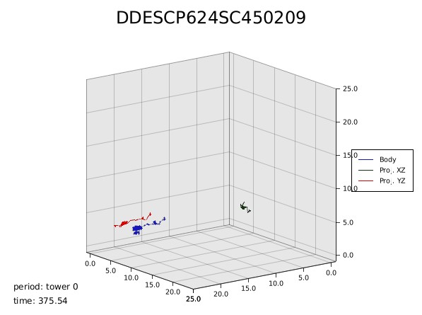

# Mouse Trajectory Viewer

Simple program that downloads stats CSV file from s3 and creates short video of trajectory during all periods.



## Installation

We need to install `rust` in the system. 

## Instruction

If you want to compile and run the code, 

```
cargo run --release -- --filekey DDESCP624SC450209
```

## Options

You can find all available options by typing the follow command. 

```
cargo run --release -- --help
```

## TODO 

- create output folder if not exists.
- check existance of stats CSV file in s3.
- integrate to web server.
